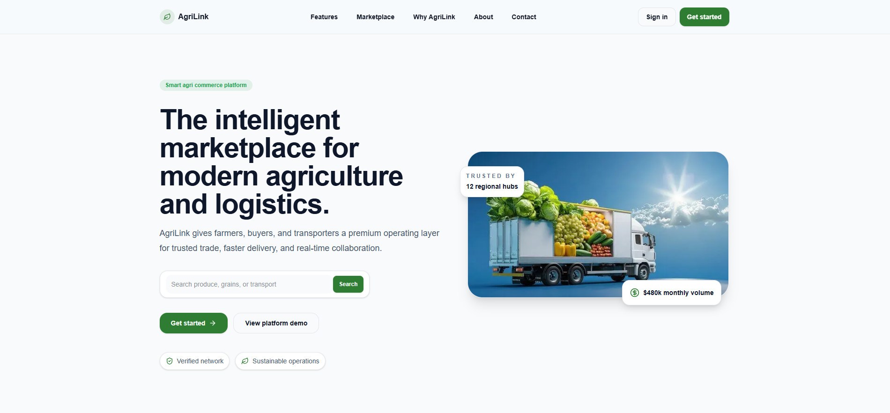
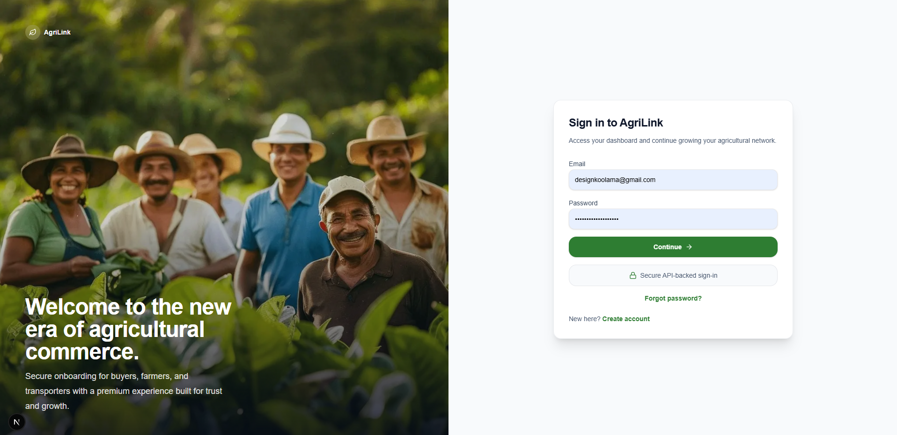
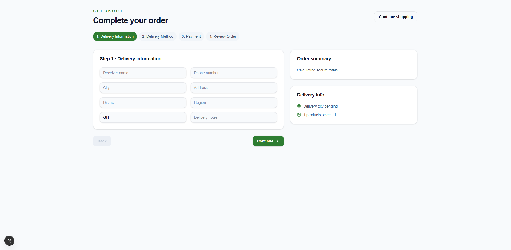
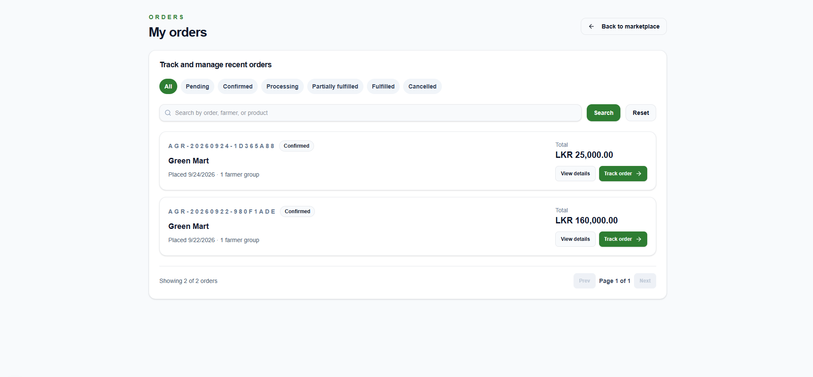
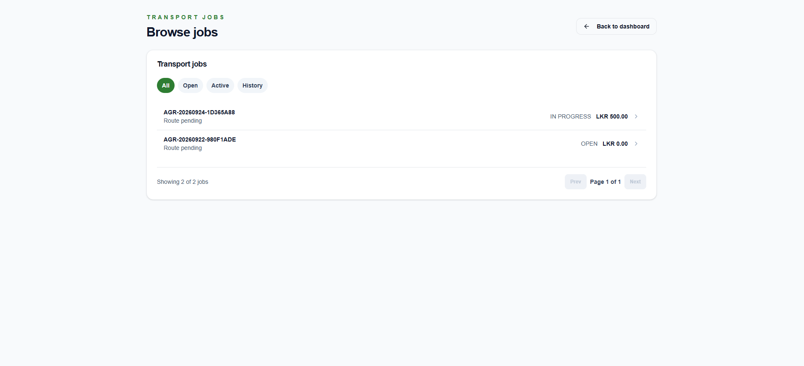
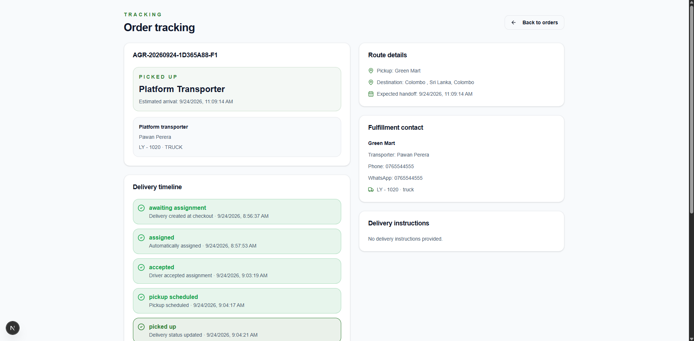

# AgriLink

**A full-stack agricultural marketplace connecting farmers, buyers, and transporters.**

## Overview

AgriLink solves a coordination problem in agricultural supply chains: farmers need a direct channel to sell produce, buyers need a reliable way to source it, and someone has to move goods between them. AgriLink models this as three distinct roles — **Farmer**, **Buyer**, and **Transporter** — each with a purpose-built workspace, sharing one marketplace and one order lifecycle. A buyer can check out from multiple farmers in a single cart; each farmer's portion is then tracked, fulfilled, and delivered independently.

## Key Features

- **Role-based authentication** — separate farmer, buyer, and transporter workspaces with JWT-based auth, email verification, and password recovery
- **Marketplace, cart & checkout** — category browsing, search/filtering, multi-farmer cart, and transactional checkout that splits one order into per-farmer fulfillment groups
- **Farmer order acceptance flow** — farmers review and accept/reject incoming orders before fulfillment begins
- **Automatic transporter assignment** — platform-delivered orders are turned into transport jobs that transporters can accept, with manual assignment as a fallback
- **Real-time delivery tracking with proof-of-delivery** — buyers and farmers track delivery status end-to-end, with photo proof-of-delivery uploads on completion
- **In-app + email notifications** — typed domain events drive both in-app notification feeds and transactional emails
- **Admin category management** — administrators curate the marketplace's product category taxonomy

## Tech Stack

| Layer | Technology |
| --- | --- |
| Frontend | Next.js 16 (App Router, Turbopack), React 19, TypeScript |
| Backend | Express 5, TypeScript, Zod validation |
| Database | PostgreSQL + Prisma ORM |
| Styling | Tailwind CSS 4 |
| Data fetching | TanStack Query |
| Auth | JWT (access + rotating refresh tokens), bcrypt |
| Media / Email | Cloudinary, Nodemailer (SMTP) |
| Testing | Vitest, Supertest, Testing Library — **113 passing tests** |
| Containerization | Docker (Dockerfile, Dockerfile.backend, Compose) |
| Deployment | Vercel (frontend), Docker-ready backend |

## Screenshots

<!--
  Drop screenshot files into docs/screenshots/ using the filenames below,
  then these will render automatically. Suggested capture size: 1280x800.
-->

**Marketplace / Homepage**


**Sign In**


**Checkout Flow**


**Farmer Order Dashboard**


**Transporter Job Details**


**Delivery Tracking**


## Architecture

AgriLink's domain model reflects its three-role structure: an **Order** placed by a buyer is split into one **FarmerOrder** per farmer in the cart, and each FarmerOrder that uses platform delivery generates its own **TransportJob**. This structure exists because a single checkout can span multiple farmers — splitting fulfillment at the FarmerOrder level lets each farmer accept/reject and fulfill their portion independently, without one farmer's stock issue or delay blocking another's.

## Local Setup

**Prerequisites:** Node.js 22+, PostgreSQL 16+

```bash
git clone https://github.com/induwara32-dmi/agrilink.git
cd agrilink
npm install
```

Copy `.env.example` to `.env` and fill in the required variables:

| Variable | Purpose |
| --- | --- |
| `DATABASE_URL` | PostgreSQL connection string |
| `JWT_ACCESS_SECRET` / `JWT_REFRESH_SECRET` | Auth token signing secrets |
| `FRONTEND_URL` / `NEXT_PUBLIC_API_URL` | Frontend/API URLs for CORS and links |
| `CORS_ORIGIN` | Allowed frontend origin(s) |
| `SMTP_HOST`, `SMTP_PORT`, `SMTP_USER`, `SMTP_PASSWORD`, `SMTP_FROM` | Email delivery |
| `CLOUDINARY_CLOUD_NAME`, `CLOUDINARY_API_KEY`, `CLOUDINARY_API_SECRET` | Image uploads |

Set up the database:

```bash
npm run prisma:generate
npm run prisma:deploy
npm run prisma:seed:categories
```

Run the backend and frontend in two terminals:

```bash
# Terminal 1
npm run backend:dev

# Terminal 2
npm run dev
```

- Frontend: `http://localhost:3000`
- API: `http://localhost:4000/api/v1`

## Testing

```bash
npm test
```

113 tests currently pass across backend services, controllers, and frontend integration points.

## Live Demo

The frontend is deployed on Vercel: **[agrilink-git-main-dimuthuinduwara32-4642s-projects.vercel.app](https://agrilink-git-main-dimuthuinduwara32-4642s-projects.vercel.app)**

Since this project requires a live backend API and database to function, **sign-in and other data-dependent features won't work on the hosted frontend alone.** For the full experience, please run the project locally following the setup instructions above.

<!-- Optionally add a demo video link here, e.g.: -->
<!-- 🎥 [Watch a demo walkthrough](your-video-link-here) -->

## Author

**Induwara Rajapaksha**
- GitHub: [github.com/induwara32-dmi](https://github.com/induwara32-dmi)
- LinkedIn: [linkedin.com/in/induwara-rajapaksha-249a65333](https://linkedin.com/in/induwara-rajapaksha-249a65333)
