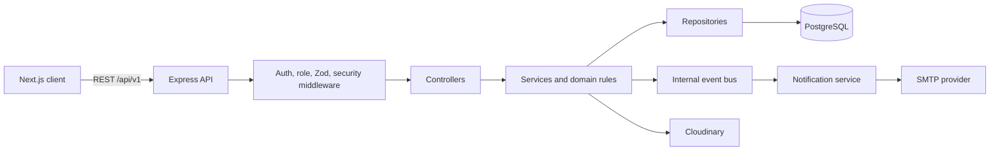

# AgriLink

[](https://github.com/induwara32-dmi/agrilink/actions/workflows/ci.yml)
[](https://nextjs.org/)
[](https://react.dev/)
[](https://www.typescriptlang.org/)
[](https://www.postgresql.org/)
[](https://www.prisma.io/)
[](https://vitest.dev/)
[](LICENSE)

AgriLink is a full-stack agricultural marketplace that connects buyers, farmers, transporters, and platform administrators. It demonstrates a responsive multi-role Next.js product, a layered Express API, transactional multi-farmer checkout, logistics assignment, notification events, analytics, Cloudinary media management, PostgreSQL domain modeling, automated tests, and container-ready deployment.

> Portfolio status: the major frontend, API, testing, and deployment-foundation phases are implemented. Payments, durable event delivery, and several secondary frontend integrations remain on the roadmap; see [Project Status](docs/PROJECT_STATUS.md).

## Features

- Role-specific buyer, farmer, transporter, and administrator workspaces
- Marketplace discovery with categories, search, filtering, sorting, and pagination
- Farmer-managed products, product images, stock thresholds, and inventory ledger
- Buyer cart, save-for-later, coupon preview, and transactional multi-farmer checkout
- Farmer-specific order groups with farmer delivery, buyer pickup, or platform transport
- Vehicle management, automatic/manual transport assignment, and delivery tracking history
- In-app and email notifications driven by typed internal domain events
- Role-scoped analytics with date ranges and previous-period comparisons
- JWT access and rotating refresh tokens, email verification, and password recovery
- Cloudinary-backed product, avatar, and proof-of-delivery image workflows
- Strict TypeScript, Zod validation, Prisma transactions, audit logging, and soft deletion
- Vitest, Supertest, Testing Library, guarded test database utilities, and coverage reports
- Multi-stage Docker images and development/production Compose templates

## Technology stack

| Layer | Technologies |
| --- | --- |
| Frontend | Next.js 16 App Router, React 19, TypeScript, Tailwind CSS 4, TanStack Query, Recharts |
| Backend | Express 5, TypeScript, Zod, Pino, Helmet, rate limiting |
| Data | PostgreSQL 16, Prisma ORM 6 |
| Authentication | JWT, rotating refresh sessions, bcryptjs |
| Media and email | Cloudinary, Multer memory storage, Nodemailer/SMTP |
| Testing | Vitest, Supertest, Testing Library, JSDOM, V8 coverage |
| Delivery | Docker, Docker Compose, Railway/Render/Vercel templates |

## Architecture overview

AgriLink is a modular monolith with independently deployable frontend and API processes. The Next.js application uses centralized typed API clients and TanStack Query. Express routes flow through authentication, role, validation, and error middleware into controllers, services, repositories, and Prisma/PostgreSQL. Business services publish typed in-process events consumed by notifications; Cloudinary and SMTP are isolated behind adapters.



See [Architecture](docs/ARCHITECTURE.md), [system design](docs/SYSTEM_ARCHITECTURE.md), and the [ERD](docs/ERD.md).

## Project structure

```text
app/                 Next.js routes, layouts, and route states
components/          Shared UI, layouts, and feature components
config/              Frontend domain and design constants
features/            Frontend feature modules
lib/api/             Central typed frontend API client and services
providers/           React application providers
src/
  controllers/       HTTP input/output adapters
  services/          Authorization and business orchestration
  repositories/      Prisma data-access boundaries
  routes/            Versioned Express route definitions
  middlewares/       Auth, roles, validation, security, and errors
  validators/        Zod request contracts
  config/            Environment, database, logging, and providers
prisma/              Schema and reviewed migrations
tests/               Backend, frontend, factories, seeds, and mocks
docs/                Product, API, architecture, security, and operations docs
scripts/             Documentation and Docker validation utilities
```

## Installation

Prerequisites: Node.js 22+, npm, PostgreSQL 16+, and optional Cloudinary/SMTP accounts.

```bash
git clone https://github.com/induwara32-dmi/agrilink.git
cd agrilink
npm ci
```

Copy `.env.example` to `.env`, replace placeholders, then prepare Prisma:

```bash
npm run prisma:generate
npm run prisma:deploy
npm run prisma:seed:categories
```

The category seed is idempotent reference-data setup: it adds only missing default product categories and never updates or deletes administrator-created categories. For production Neon usage, follow the reviewed sequence in [Deployment](docs/DEPLOYMENT.md#default-category-seed).

## Environment variables

The complete reference and production guidance live in [Deployment](docs/DEPLOYMENT.md#production-environment-variables). Important groups are:

| Group | Variables |
| --- | --- |
| Runtime | `NODE_ENV`, `PORT`, `LOG_LEVEL`, `FRONTEND_URL` |
| Database | `DATABASE_URL`, `TEST_DATABASE_URL` |
| Browser/API | `NEXT_PUBLIC_API_URL`, `CORS_ORIGIN`, `TRUST_PROXY` |
| Security | `JWT_ACCESS_SECRET`, `JWT_REFRESH_SECRET`, token lifetimes, bcrypt and cookie settings |
| Rate limits | `RATE_LIMIT_WINDOW_MS`, `RATE_LIMIT_MAX`, `AUTH_RATE_LIMIT_MAX` |
| Email | `SMTP_HOST`, `SMTP_PORT`, `SMTP_SECURE`, `SMTP_USER`, `SMTP_PASSWORD`, `SMTP_FROM` |
| Media | `CLOUDINARY_CLOUD_NAME`, `CLOUDINARY_API_KEY`, `CLOUDINARY_API_SECRET` |

Never expose backend secrets through `NEXT_PUBLIC_` variables or commit local environment files.

## Local development

Run the API and frontend in separate terminals:

```bash
npm run backend:dev
npm run dev
```

- Frontend: `http://localhost:3000`
- API: `http://localhost:4000/api/v1`
- Health: `http://localhost:4000/api/v1/health`
- Readiness: `http://localhost:4000/api/v1/readiness`

Useful quality commands:

```bash
npm test
npm run test:coverage
npm run lint
npm run backend:typecheck
npm run backend:build
npm run build
```

## Docker setup

Development:

```bash
docker compose up --build
```

Production template:

```bash
docker compose -f docker-compose.prod.yml up --build -d
```

Run `npm run docker:validate` for structural Compose and Dockerfile validation. The detailed migration, health-check, backup, and restore workflow is in [Deployment](docs/DEPLOYMENT.md).

## Deployment

The frontend can run on Vercel or its container image. The Express API can run on Railway, Render, or another container host, with Neon or managed PostgreSQL as the database. Production deployments require HTTPS, explicit CORS origins, secure cookies, independent JWT secrets, managed backups, Cloudinary, and production SMTP. See the [deployment guide](docs/DEPLOYMENT.md) for provider-specific steps.

GitHub Actions validates every push and pull request, provides protected manual deployment templates for Vercel, Railway, and Render, and publishes checked release artifacts for `v*` tags. See [CI/CD](docs/CI_CD.md).

## API overview

The Express API exposes 75 operations under `/api/v1` for authentication, catalog and inventory, cart and orders, logistics and vehicles, notifications, analytics, and media. Responses use a stable success/error envelope; protected endpoints accept `Authorization: Bearer <access-token>`.

- Human guide: [API Reference](docs/API_REFERENCE.md)
- OpenAPI 3.1: [openapi.yaml](docs/openapi.yaml)
- Postman: [AgriLink.postman_collection.json](docs/AgriLink.postman_collection.json)
- Regenerate both artifacts: `npm run docs:api`

Payment and messaging resources in planning documents are not advertised as implemented endpoints.

## Screenshots

The responsive UI includes marketplace, role dashboards, checkout, order tracking, notification, and media-management experiences. Repository screenshots are intentionally pending a dedicated release capture so portfolio images reflect seeded production-like data rather than development fixtures. The live application or local Docker environment is the current visual reference.

| Experience | Route |
| --- | --- |
| Landing and marketplace | `/`, `/marketplace` |
| Buyer dashboard and checkout | `/buyer`, `/cart`, `/checkout` |
| Farmer operations | `/farmer` |
| Transport operations | `/transporter` |
| Platform administration | `/admin` |
| Orders and tracking | `/orders`, `/orders/[orderId]/tracking` |

## Roadmap

Completed foundations include UI stabilization, relational domain design, core backend modules, main frontend API integrations, media management, automated tests, and deployment preparation. Next priorities are payment processing, a durable event outbox/queue, remaining wishlist/recently-viewed API integration, broader integration and end-to-end tests, observability, and production acceptance. See the [roadmap](docs/ROADMAP.md).

## Contributing

Contributions are welcome through focused issues and pull requests. Read [PROJECT_RULES.md](PROJECT_RULES.md) before starting: preserve the current architecture and visual language, reuse existing components and design tokens, keep TypeScript strict, add or update tests, and run lint and builds. Use Conventional Commits and never redesign completed modules without approval.

## Contributors

- [induwara32-dmi](https://github.com/induwara32-dmi) — project maintainer
- [All contributors](https://github.com/induwara32-dmi/agrilink/graphs/contributors)

## License

AgriLink is available under the [MIT License](LICENSE).
