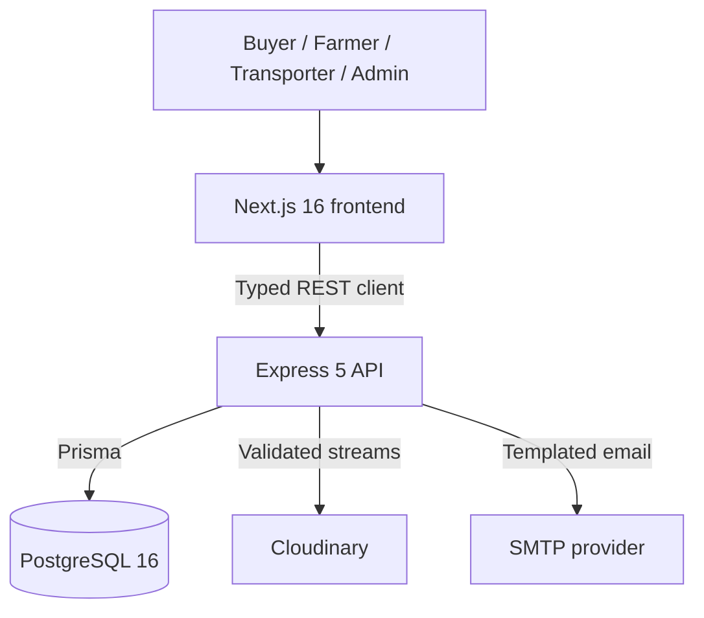
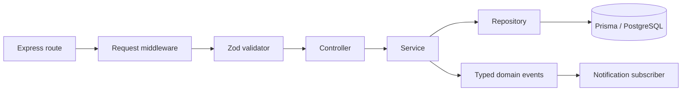

# AgriLink Architecture

## System context

AgriLink is a modular monolith split into two deployable Node.js processes: a Next.js frontend and an Express REST API. PostgreSQL is the transactional source of truth. Cloudinary stores media; SMTP delivers transactional email. This shape preserves strong order/inventory transactions while keeping hosting and local development straightforward.

## Frontend

The Next.js App Router application lives in `app/`. React Server Components are preferred; client components are used for forms, browser session state, polling, drawers, filters, and charts. `components/ui` owns reusable primitives, `components/features` owns domain presentation, and `components/layout` owns shared navigation shells. Design tokens remain centralized in `app/globals.css` and `config/theme.ts`.

All active backend integrations pass through the typed client under `lib/api`. It centralizes the API base URL, success/error envelope parsing, bearer tokens, refresh rotation, and retry behavior. TanStack Query manages remote caching, invalidation, loading/error states, and polling. Authentication and role guards protect UI routes for user experience, while the API remains the security boundary.

## Backend request flow

- **Routes** declare HTTP methods, role gates, uploads, validation, and controllers.
- **Middleware** adds request IDs/logging, security headers, CORS, rate limits, authentication, roles, validation, and centralized errors.
- **Controllers** translate validated HTTP requests into service calls and the stable API envelope.
- **Services** enforce ownership, lifecycle, calculation, and transaction rules.
- **Repositories** isolate Prisma queries and transactional persistence.
- **Validators** define transport contracts with Zod.

Dependencies flow inward: repositories do not call controllers, and domain services do not depend on frontend concerns.

## Domain boundaries

| Boundary | Responsibilities |
| --- | --- |
| Identity | registration, login, refresh rotation, logout, verification, recovery, current user |
| Catalog | categories, products, discovery, publication, product ownership |
| Inventory | balances, reservations, movements, reorder thresholds, low stock |
| Commerce | cart, coupons, checkout, multi-farmer orders, cancellation |
| Logistics | delivery lifecycle, transport jobs, assignment, vehicles, proof |
| Notifications | event subscription, in-app state, email templates and delivery results |
| Analytics | role-scoped aggregation, comparisons, replaceable cache abstraction |
| Media | Cloudinary uploads/deletes and durable reference updates |

## Transaction boundaries

Checkout is the central aggregate transaction. It reprices and validates the cart, groups by farmer, creates the parent order and farmer orders, snapshots items and delivery data, reserves inventory, records status history, applies coupon redemption, creates delivery/payment aggregates, and emits events only after success. Inventory adjustments pair each balance change with an immutable movement. Logistics acceptance prevents driver/vehicle conflicts, and delivery completion finalizes reservations and history atomically.

`Order` represents one buyer checkout. `FarmerOrder` represents one participating farmer and owns its delivery method. This avoids duplicating parent data while allowing each farmer group to progress independently.

## Events and asynchronous work

Business services publish typed events after successful transactions. An in-process subscriber creates idempotent notifications, renders centralized email templates, and records email delivery outcomes. This is suitable for the current single-process foundation. Multi-instance production requires a transactional outbox plus durable queue/worker so a process failure cannot lose post-commit work.

## Data and caching

Prisma maps the normalized PostgreSQL model defined in `prisma/schema.prisma`. UUID keys, decimal money/quantity, indexes, unique constraints, safe delete behavior, immutable histories, and selected soft deletes support commercial integrity. See [ERD](ERD.md), [data dictionary](DATA_DICTIONARY.md), and [business rules](BUSINESS_RULES.md).

Analytics uses a bounded in-memory cache behind an interface. Redis may replace it without changing controllers or repositories; shared cache invalidation is required before horizontally scaling analytics.

## Deployment topology

The production template contains frontend, backend, one-shot migration, and PostgreSQL services. Managed deployments may place the frontend on Vercel, API on Railway/Render, PostgreSQL on Neon, and media/email with their external providers. TLS terminates at the platform proxy. API readiness checks include database connectivity; graceful shutdown stops accepting traffic and disconnects Prisma. See [Deployment](DEPLOYMENT.md).

## Architecture constraints

- Never trust frontend authorization, totals, stock, or lifecycle states.
- Never combine amounts in unlike currencies.
- Never log secrets, password hashes, raw tokens, payment credentials, or private upload credentials.
- Keep controllers thin and business invariants in services/transactions.
- Preserve append-only histories and audit logs.
- Do not redesign completed frontend modules without approval.
- Add a new service boundary only when it has a clear domain responsibility; avoid premature microservices.

## Known evolution points

- Payment provider integration and idempotent webhooks
- Durable outbox, queue, retries, and background worker
- Redis-backed analytics caching for multiple API replicas
- Remaining wishlist/recently-viewed frontend/backend contracts
- Real-time delivery updates after REST polling, if business needs justify WebSockets
- Expanded integration/end-to-end testing, observability, and production acceptance
