# AgriLink Entity Relationship Diagram

## Relational model

The diagram shows the production domain boundaries and cardinalities. `Order` is the buyer-level checkout aggregate; `FarmerOrder` is the commercial and fulfillment group for one farmer. Supporting history and transaction tables are append-oriented audit records.

```mermaid
erDiagram
    User ||--o| Profile : has
    User ||--o| BuyerProfile : has
    User ||--o| FarmerProfile : has
    User ||--o| TransporterProfile : has
    User ||--o| AdminProfile : has
    User ||--o{ Address : owns
    User ||--o{ Vehicle : owns
    User ||--o{ Notification : receives
    User ||--o{ AuditLog : performs
    User ||--o{ RefreshToken : owns
    RefreshToken o|--o| RefreshToken : rotates_to
    User ||--o{ EmailVerificationToken : verifies_with
    User ||--o{ PasswordResetToken : resets_with

    Category o|--o{ Category : contains
    FarmerProfile ||--o{ Product : lists
    Category ||--o{ Product : classifies
    Product ||--o{ ProductImage : displays
    Product ||--o| Inventory : stocks
    Inventory ||--o{ InventoryMovement : records
    User o|--o{ InventoryMovement : performs

    User ||--o{ Cart : owns
    Address o|--o{ Cart : selected_for
    Cart ||--o{ CartItem : contains
    Product ||--o{ CartItem : selected_as
    User ||--o| Wishlist : owns
    Wishlist ||--o{ WishlistItem : contains
    Product ||--o{ WishlistItem : saved_as
    User ||--o{ RecentlyViewedItem : views
    Product ||--o{ RecentlyViewedItem : viewed_as

    User ||--o{ Order : places
    Order ||--|{ FarmerOrder : groups
    FarmerProfile ||--o{ FarmerOrder : fulfills
    FarmerOrder ||--|{ OrderItem : contains
    Product ||--o{ OrderItem : snapshots
    Order ||--o{ OrderStatusHistory : records
    User o|--o{ OrderStatusHistory : changes
    FarmerOrder ||--o{ FarmerOrderStatusHistory : records
    User o|--o{ FarmerOrderStatusHistory : changes

    FarmerOrder ||--o| Delivery : fulfills_through
    Delivery ||--o{ DeliveryStatusHistory : records
    User o|--o{ DeliveryStatusHistory : changes
    Vehicle o|--o{ Delivery : direct_vehicle
    Delivery ||--o| TransportJob : offers
    TransporterProfile o|--o{ TransportJob : accepts
    User o|--o{ TransportJob : accepted_by
    Vehicle o|--o{ TransportJob : assigned_vehicle
    TransportJob ||--o{ TransportJobRejection : records
    User ||--o{ TransportJobRejection : rejects
    Delivery ||--o| RoutePlan : follows

    Order ||--o| Payment : pays
    Payment ||--o{ PaymentTransaction : attempts
    FarmerOrder ||--o{ Review : authorizes
    User ||--o{ Review : writes
    User ||--o{ Review : receives

    Conversation ||--|{ ConversationParticipant : includes
    User ||--o{ ConversationParticipant : joins
    Conversation ||--o{ Message : contains
    User o|--o{ Message : sends
    Order o|--o{ Conversation : contextualizes
    FarmerOrder o|--o{ Conversation : contextualizes

    Coupon ||--o{ CouponRedemption : records
    User ||--o{ CouponRedemption : redeems
    Order ||--o{ CouponRedemption : discounts
```

## Major relationships

### Identity and role profiles

`User` is the authentication principal and carries exactly one `Role`. Common personal data is stored in `Profile`; a user has only the specialized profile matching the role. Role profiles are separated so farmer verification, transporter availability, and admin provenance do not create sparse or unsafe columns on every user. Admin creation is a privileged service operation, never a public registration path.

### Catalog and inventory

A verified farmer owns products. Each product belongs to one category, has ordered images, and has one inventory balance. `InventoryMovement` is the immutable ledger explaining changes to the current balance. Category adjacency supports a hierarchy without duplicating category paths.

### Cart and wishlist

A buyer can have historical carts but only one active cart, enforced later with a PostgreSQL partial unique index. One cart line exists per product. The UI may group lines through each product's farmer. A delivery preference on a cart line is provisional; checkout validates that every line for the same farmer resolves to one method. A buyer owns one wishlist with unique product entries. `RecentlyViewedItem` stores the latest view per buyer/product and supports recency ordering without copying product data.

### Multi-farmer checkout

`Order` owns buyer-level totals, payment, coupons, and aggregate status. It contains one `FarmerOrder` per participating farmer. The child row owns its delivery method, farmer totals, immutable address snapshot, items, fulfillment status, delivery, and reviews. `OrderItem` keeps product identity plus name, unit, price, and quantity snapshots so historical orders survive catalog changes.

### Delivery and transport jobs

Each farmer group may have one `Delivery`. For farmer delivery or buyer pickup, `Delivery.vehicleId` can reference a vehicle owned by the relevant user. Platform delivery creates one `TransportJob`; automatic or audited admin assignment selects an available verified transporter and compatible vehicle. Rejections are preserved in `TransportJobRejection` and excluded from automatic reassignment. `RoutePlan` stores the chosen route snapshot, while `DeliveryStatusHistory` provides the ordered tracking timeline.

### Payments and commercial records

An order has at most one payment aggregate and any number of idempotent provider transactions. Coupon redemptions preserve the applied discount. A delivered farmer group can authorize reviews, tying a verified purchase to both author and review subject.

### Messaging, notifications, and auditing

Conversations use an explicit participant join model for buyer, farmer, transporter, and support membership. Messages retain nullable senders so account removal does not destroy the conversation record. Notifications are per-user delivery records. `AuditLog` captures privileged and security-relevant actions without owning mutable domain state.

## Integrity beyond the Prisma schema

Some invariants require database check constraints, partial indexes, or transactional service logic and therefore belong in a future reviewed migration:

- one active cart per buyer;
- non-negative inventory balances and monetary totals;
- rating between 1 and 5;
- percentage coupons within the accepted range;
- role/profile consistency;
- vehicle owner role matching its delivery use;
- a transport job only for `PLATFORM_TRANSPORTER`;
- exactly one delivery method per farmer group; and
- aggregate order totals/status derived consistently from farmer groups.
